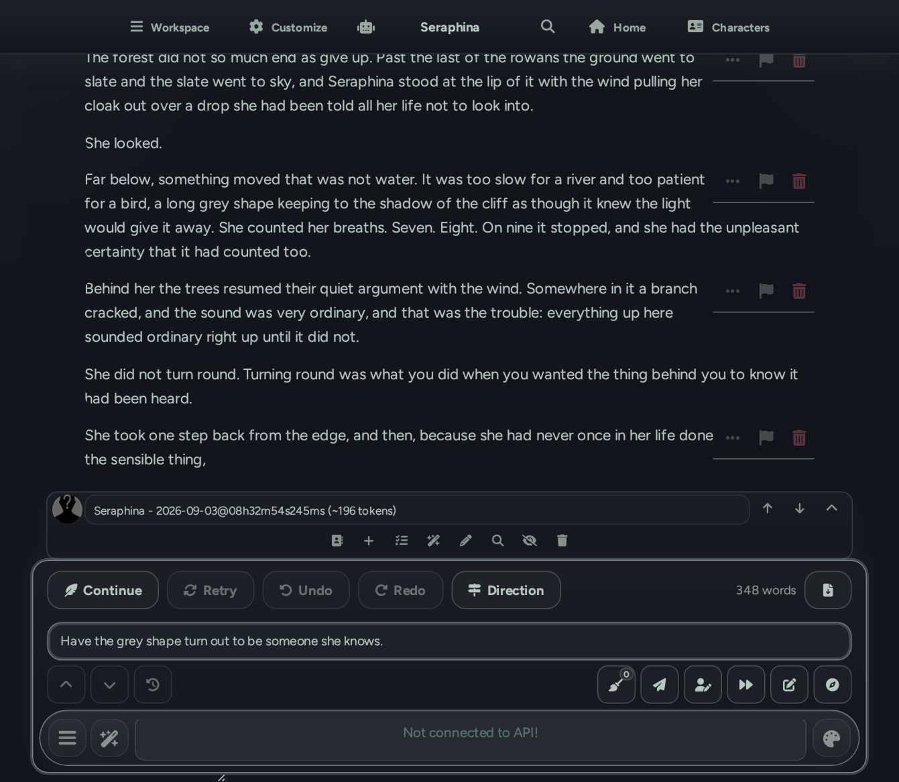
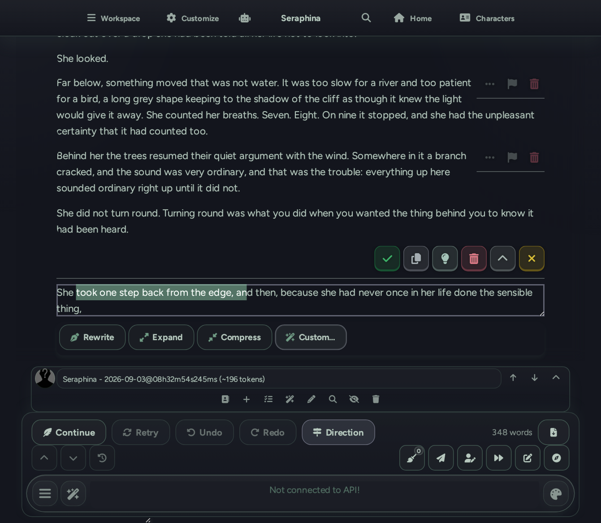
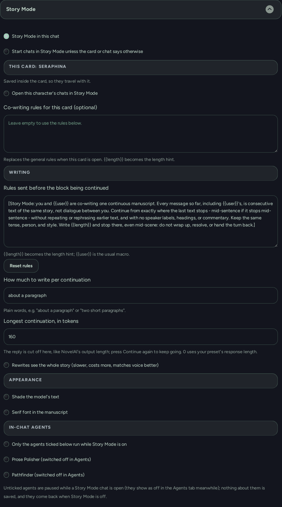
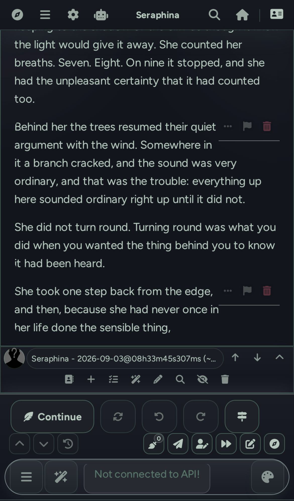

# SillyBunny Story Mode

NovelAI-style co-writing inside SillyBunny: one continuous manuscript that the user and the model extend together, with tap-to-edit, retry and undo for continuations, selection rewrites, and a one-shot direction line.

Story Mode is a per-chat mode. Switched on, the chat stops being a row of speech bubbles and reads as one manuscript; **Continue** makes the model pick up exactly where the text stops, mid-sentence if that is where it stops, and each continuation is cut off at a short token limit so it stays a passage rather than a whole reply. The chat *is* the manuscript: every paragraph is still a normal message underneath, so the character card, the lorebook, Author's Note, Summarize and the In-Chat Agent companions keep working without knowing Story Mode exists. Selection rewrites and the direction line borrow from [errata](https://github.com/tealios/errata).



| Editing a paragraph, with the rewrite row under the box | Settings |
| --- | --- |
|  |  |



## What it does

- Turns the open chat into a continuous manuscript: no avatars, names, timestamps or message boxes, a readable column width, and the text sitting directly on the theme's own chat background.
- **Continue** extends the last block, or adds the composer text as a new block first and continues from the end of it. Alt+Enter does the same from the keyboard.
- Cuts each continuation off at a token limit (160 by default, 0 uses the preset's response length), the way NovelAI's output length works, so the model stops short and the next Continue picks up from there.
- **Retry** redoes the last continuation, **Undo** removes it, **Redo** puts it back; Alt+R, Alt+Z and Alt+Y from the keyboard. Cut points are saved with each message and checked against the text, so Undo survives a reload without applying stale offsets to edited text.
- **Export** downloads the manuscript as a plain text file: no speaker names, hidden blocks left out, and a paragraph that stopped mid-sentence runs straight into the next. The bar keeps a running word count next to it.
- **Direction** takes a one-line instruction that goes to the model for the next continuation only and is cleared afterwards.
- Holds off the host's bare left and right arrow keys, which otherwise swipe the whole last block away; the on-screen swipe arrows still work.
- Tap any paragraph to edit it in SillyBunny's own message editor, restyled to look like the page. Escape and the tick both keep the edit.
- Select text while editing and **Rewrite**, **Expand**, **Compress** or give a **Custom** instruction; the result replaces the selection in place.
- Optionally shades text the model wrote, including only the model's part of a paragraph the user started.
- Lets the user choose which In-Chat Agents may run while Story Mode is on, and holds the rest off without changing their own settings.
- Remembers the mode per chat; a card can ask for it by default, and there is a global start-in-Story-Mode switch.

## Using it

**Turning it on.** The wand menu (🪄) has a **Story Mode** entry, or use `/story on`, `/story off`, or `/story` to toggle. The choice is stored in the chat. A card can request Story Mode for its chats (see the card section below), and a global setting starts every chat in it.

**Continue.** The button above the composer. With text in the box, that text goes in as the next block and the model continues from the end of it; with the box empty, the model extends the last paragraph. Both go through SillyBunny's own Continue, so with Claude and 'Continue prefill' on, a model block is handed back as a prefill and continuations pick up mid-word. The token limit applies only to Story Mode's own continuations, never to the normal send button; press Continue again to keep going.

**Retry, Undo, Redo.** Retry redoes the last continuation, Undo removes it, Redo puts it back. If the last block came from the normal send button, Retry swipes it and Undo deletes it, which is SillyBunny's usual behaviour. The three buttons are disabled when there is nothing for them to do, so a block the user typed cannot be undone by accident. Retry with a draft sitting in the composer parks the draft, redoes the continuation, then hands the draft back. On a phone, or with a narrow chat pane, the buttons shrink to icons, Continue keeps its label, and the word count and Export step off the bar so it stays one row.

**Keys.** Alt+Enter continues, Alt+R retries, Alt+Z undoes, Alt+Y redoes; each does exactly what its button does, including nothing while the button is disabled. Bare ArrowLeft and ArrowRight, which swipe the last block in a normal chat, do nothing while Story Mode is on. The host's other shortcuts (Ctrl+Enter, ArrowUp to edit) are untouched.

**Export and word count.** The download arrow at the right end of the bar saves the whole manuscript as `<character> - <date>.txt`: plain text, no `Name:` prefixes, hidden blocks skipped, a block that stopped mid-sentence joined to the next with a space and everything else separated by a blank line. The number beside it is the manuscript's word count, refreshed whenever the chat changes; tokens with no letters or digits (`* * *`, `--`) are not counted. Both stay off the bar on a phone.

**Direction.** The signpost button opens a one-line box. Whatever is typed there is sent for the next continuation only ('Have the stranger turn out to be her brother'), then cleared. Enter in the box continues; Escape closes it. Close the box with a direction still in it and the button stays tinted, so it is plain that the next Continue is steered.

**Editing.** Tapping a paragraph opens SillyBunny's message editor for that block, so the host's pencil icon is hidden; the flag and the bin stay. The host normally discards an edit on Escape; in Story Mode Escape keeps it, as does the tick. Tapping another paragraph saves the open one first. With the host's 'Expand message actions' setting on, the icon row is a dozen icons wide, so it gets its own line above each paragraph instead of sitting beside the first one.

**Rewriting a selection.** While a paragraph is open for editing, selecting text shows a row under the box: Rewrite, Expand, Compress, Custom. The row stays on screen while a long paragraph scrolls. The result replaces the selection and stays selected, so another pass can be run on it straight away. Nothing is saved until the editor is closed, unless SillyBunny's message-edit auto-save setting is on, and the row says when the browser added the change to Ctrl+Z history. By default the model sees the selection and a couple of paragraphs either side; a setting sends the whole story instead for a closer match to the voice.

**Agents.** The bundled In-Chat Agents keep working in Story Mode because they read the chat like anything else. To restrict them in stories (Plot Compass and Continuity, say, but not trackers that write into the text), tick 'Only the agents ticked below run while Story Mode is on' in the settings and choose the agents. While a Story Mode chat is open the others are held off and show as off in the Agents tab for that time; nothing about them is saved, and they come back as soon as Story Mode is off in that chat or another chat is opened. Story Mode's continuations count as 'continue' generations, so an agent only fires on them if its own trigger list includes Continue (Direction Menu ships with Normal only).

**Room to read.** Above the mobile shell, the chat column grows to about 58em while Story Mode is on, unless the Chat Width setting is already wider, and the text itself stays under about 50em per line.

**Background and shading.** The manuscript sits directly on the theme's chat background. Story Mode clears the message boxes, including the per-message tint that the Echo, Whisper, Hush, Ripple and Tide chat styles paint behind the text. 'Shade the model's text' in the settings adds a faint shade to text the model wrote; when the model finishes a paragraph the user started, only its part is shaded, and editing a block resets that block to plain.

## What the model sees

The usual SillyBunny prompt. Story Mode adds one short system line just before the block being continued: the two of you are co-writing one manuscript, keep going from exactly where the text stops, write roughly this much and stop there without wrapping up. The text is editable in the settings, and a card can carry its own version. When a roleplay preset still makes the model finish whole scenes, the token limit is what actually stops it.

Everything else comes from the existing setup:

- the card's description, personality and scenario sit at the top, like NovelAI's Memory
- Author's Note and the card's depth prompt land a few messages from the end, like NovelAI's Author's Note
- World Info is the Lorebook
- the Summarize extension is the rolling memory, and the bundled In-Chat Agent companions (Plot Compass, Direction Menu, Continuity, Memory Shard, Lorebook Scout) keep working because they read the chat

## Setting up a card for Story Mode

A card is a workable container for a whole story:

- **Description, personality, scenario** - the story bible: the world, the premise, the cast in a paragraph each, the tone. This is the always-on block, the NovelAI 'Memory'.
- **First message and alternate greetings** - the openings. Several prologues can ship in one card; greeting swipes switch between them.
- **Example messages** - two or three short passages in the intended voice: tense, person, rhythm.
- **System prompt** - co-writing rules for this card when the general ones do not fit. With 'Prefer character prompt' on it replaces the preset's main prompt.
- **Post-history instructions** - the last-minute reminder: pacing, 'end mid-scene', 'never summarise'.
- **Character's note (depth prompt)** - a shipped Author's Note, N messages from the end.
- **Embedded lorebook** - the Lorebook proper, one concept per entry. Import it when SillyBunny offers to; an embedded book is not scanned until it is a real lorebook file.
- **Creator notes and tags** - the blurb and genre, never sent to the model.
- **Story Mode's own card settings** - in Customize › Extensions › Story Mode while the card is open: 'Open this character's chats in Story Mode', and optional rules that replace the general ones. Both live inside the card and travel with it.

For an ensemble, put a 'Narrator' card (world and style) and one card per lead into a group with 'join character cards' on. The persona is either the protagonist (first person: its description is the protagonist's memory) or nobody (third person: an empty persona). To talk to a character about the story, open a second chat with the same card, or turn on the bundled Actor Interview companion.

## Limits worth knowing

- Chat completion APIs are the happy path. Text completion backends prefix every block with a name (`Ann:`), which spoils the manuscript; an instruct template with names off is the workaround.
- Empty-box Continue works in groups. With text in the composer, send it first: the host does not add composer text during a group continuation, so Story Mode refuses rather than continuing the wrong block.
- Story Mode pauses the host's Auto-continue setting only while its own request runs, then restores it, so one Continue stays one undoable passage.
- The shading of a model tail inside a user paragraph is measured against the rendered text, so markdown that straddles the join can shift it by a few characters.
- Rewrites and the custom instruction are one-shot calls without streaming, and the host's Stop button does not reach them; the row has its own Stop.
- Redo history lives in memory, is forgotten on a chat switch, and is discarded after a divergent edit or generation.
- `GENERATION_ENDED` does not arrive on the mobile shell, so the bar follows the host's own generating markers instead; the agents allow-list and the token limit rely only on events that fire on every platform.
- The token limit is armed right before Story Mode's own request goes out, so an agent that makes its own model call earlier in the same Continue keeps its own length. One gap remains: on a text completion backend, an agent that runs a full nested generation at that point takes the limit instead of the continuation.
- Export reads the message text itself, not what another extension shows in its place (a translation, say).

## Settings

Customize › Extensions › Story Mode, in four groups: the switches (per chat, the start-in-Story-Mode default, and the open card's own switch and rules); Writing (the rules text with a reset, the length hint, the token limit per continuation, and whether rewrites see the whole story); Appearance (shading, off by default, and the serif font); and which In-Chat Agents may run while Story Mode is on. While the open card carries its own rules, the general rules are labelled as unused and dimmed, so there is no guessing which set the model gets.

## Install

Use SillyBunny's extension installer with `https://github.com/platberlitz/SillyBunny-Story-Mode`, or clone it into `data/<user>/extensions/` (one user) or `public/scripts/extensions/third-party/` (everyone), then make sure it is enabled under Customize › Extensions. No build step, no dependencies.

## Development

```sh
npm test      # node --test
npm run check # node --check on every JavaScript file
```

`src/core.js` is pure and covered by tests, `src/api.js` is every call into the host, `src/ui.js` is the DOM, `style.css` is the manuscript look gated on `body.sbstory`, and `index.js` owns lifecycle and event wiring. The version lives in `manifest.json` and `package.json`.

## License

AGPL-3.0
